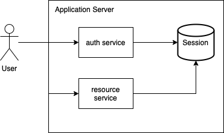

# Introduction

This repository contains about how session management works in golang (Gin Framework).

# Tech Stack

I used these tech stack for create this project with:
* Golang
* [Gin](https://github.com/gin-gonic/gin)
* MySQL
* Swagger 2

# Architecture

Detail : [Click Here](https://github.com/rizkyjayusman/cygnus/tree/approach/syncronous-way)

# Implemented Features

This tables shows which features that has been implemented by this repository.

:white_check_mark: : ready

:heavy_exclamation_mark: : in progress

:x: : not yet implemented

| Features                          | Status                              |
| --------------------------------- | ----------------------------------- |
| [Cookie Based](https://github.com/rizkyjayusman/authentication/tree/main/apikey-auth) | :x:                  |
| [Centralized Session Management Using Redis](https://github.com/rizkyjayusman/authentication/tree/main/basic-auth) | :x:                 |